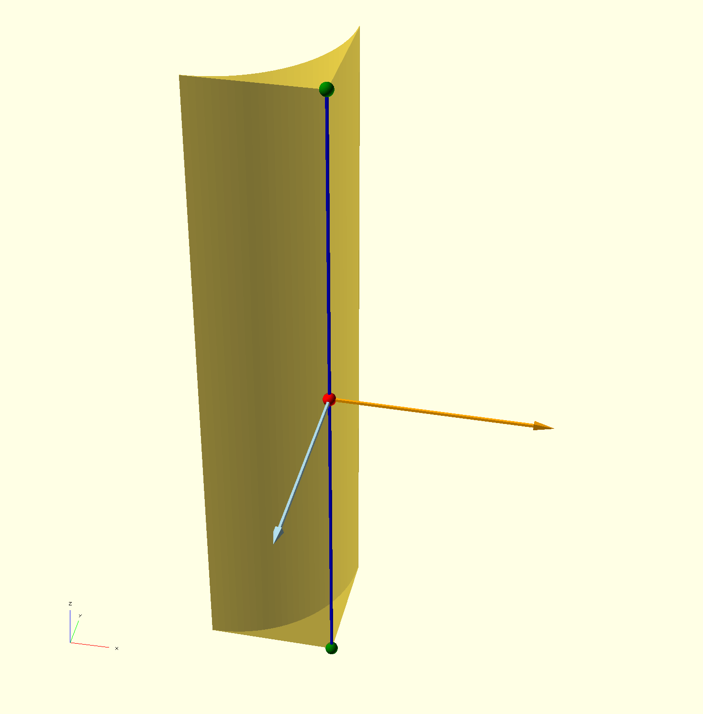
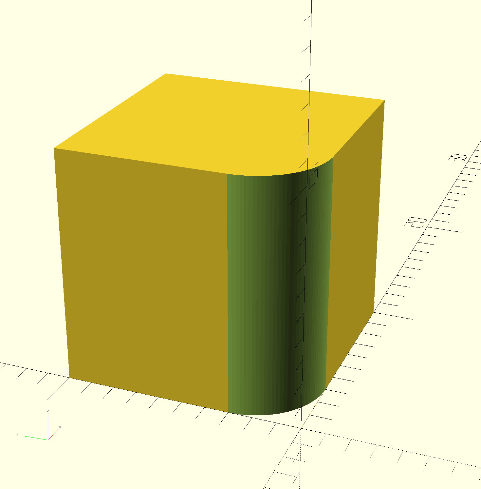
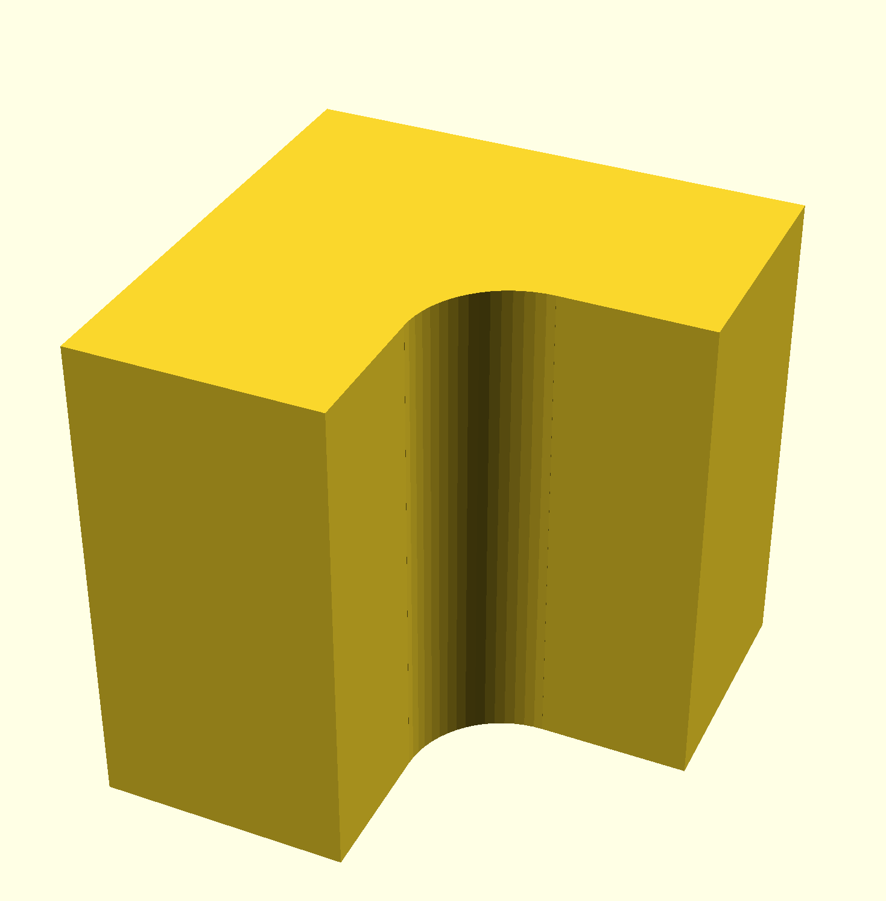
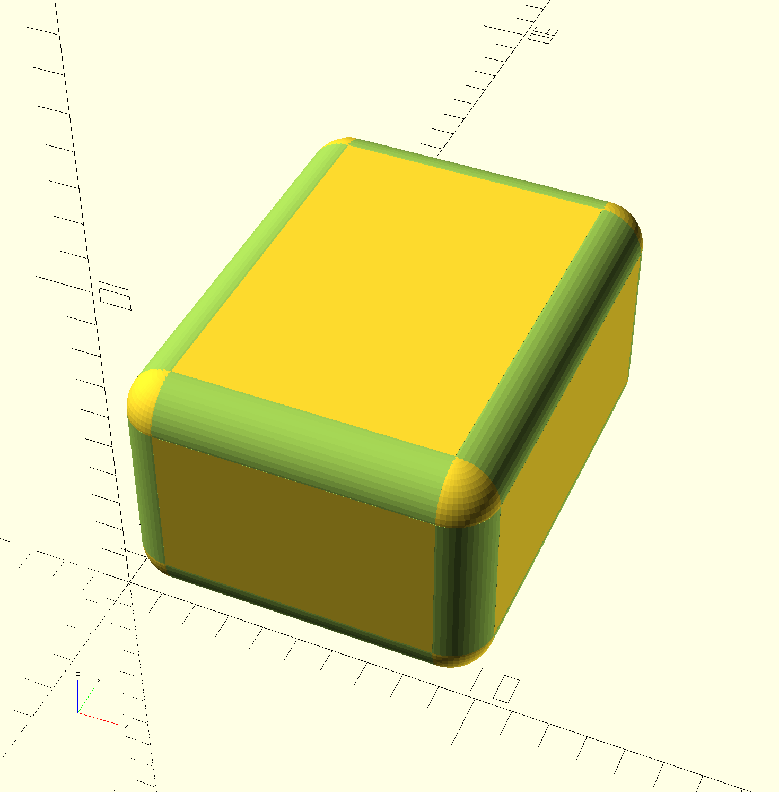
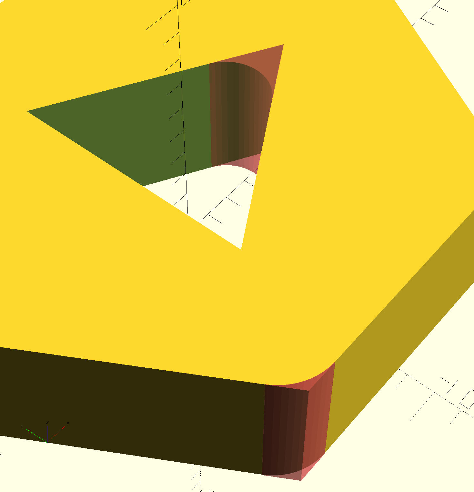

# Davel
(**DAV**orl (that is me) makes bev**EL** :-) )

A simple bevel library for [OpenSCAD](https://openscad.org/).

## Introduction

Bevels and buttresses are used to soften sharp corners. Bevels are supposed to be *subtracted* from your object, buttresses are *added* to it.

Bevels and buttresses generated by this library are just slices of cylinders, so they should be quite fast to render.

## Usage

To use this library, copy `davel.scad` to your `libraries` OpenSCAD folder. You can use the menu `File` / `Show library folder...` to open it.

Then include the library at the beginning of your code with:

    use <davel.scad>

## Common parameters

To draw a bevel or a buttress you need to know:

- **where** you want it to appear;
- **how long** you want it to be;
- **the normals** of the two surfaces you want to blend together;
- **the radius** of the generated curve;
- (optional) **how much offset to add** to the sides and back of the bevel or buttress, to better merge it to the rest of the object and avoid artifacts in the preview window (optional);
- (optional) **how many subdivisions** you want the bevel or buttress to have.

In the above image:

- The blue line is the edge (corner) that you want to smooth, where the two faces meet.
- The green dots are the end points of the edge (used in the *points* version of the bevel or buttress, see below).
- The red dot is the midpoint of the edge, where the local origin is.
- The orange and light blue vectors are the normals of the two surfaces you want to smooth with a bevel.

## Bevels

Depending on how you want to specify position and length there are three slightly different versions of the bevel module:

### Bevel, basic version

    module davel_bevel(length, n1, n2, r, side_offset=0.01, back_offset = 0.01)

- `length`: length of the bevel, longitudinally.
- `n1`: normal vector of the first surface.
- `n2`: normal vector of the second surface.
- `r`: radius of the bevel.
- `side_offset`: extra length added to the sides (optional, default 0.01).
- `back offset`: extra thickness added to the back of the bevel (optional, default 0.01).

There is no position parameter in this basic version; the origin point is set on the middle point of the edge to be smoothed; you have to `translate()` it manually.

### Bevel, "position" version

    module davel_bevel_pos(pos, length, n1, n2, r, side_offset=0.01, back_offset = 0.01)

- `pos`: 3-dimension vector position.
- `length`: length of the bevel, longitudinally.
- `n1`: normal vector of the first surface.
- `n2`: normal vector of the second surface.
- `r`: radius of the bevel.
- `side_offset`: extra length added to the sides (optional, default 0.01).
- `back offset`: extra thickness added to the back of the bevel (optional, default 0.01).

This just a convenience wrapper: it adds a new first parameter `pos` which is used to `translate()` the bevel (it refers to the midpoint of the edge).

### Bevel, "points" version

    module davel_bevel_points(p1, p2, n1, n2, r, side_offset=0.01, back_offset = 0.01)

- `p1`: 3-dimension vector of the first end.
- `p2`: 3-dimension vector of the second end.
- `n1`: normal vector of the first surface.
- `n2`: normal vector of the second surface.
- `r`: radius of the bevel.
- `side_offset`: extra length added to the sides (optional, default 0.01).
- `back offset`: extra thickness added to the back of the bevel (optional, default 0.01).

Instead of passing the position of the midpoint and the length, with this variation you can pass the coordinates of the two ends of the edge to be smoothed.

## Buttresses

Buttresses are identical to bevels (and, in fact, they share che same code) except for one thing: since a buttress is *added* to the object (not subtracted), the default `side_offset` value is 0; it would otherwise produce a discontinuity in the object surface.

The same three variations are present:

### Buttress, basic version

    module davel_buttress(length, n1, n2, r, side_offset=0, back_offset = 0.01)

- `length`: length of the bevel, longitudinally.
- `n1`: normal vector of the first surface.
- `n2`: normal vector of the second surface.
- `r`: radius of the bevel.
- `side_offset`: extra length added to the sides (optional, default 0).
- `back offset`: extra thickness added to the back of the buttress (optional, default 0.01).

### Buttress, "position" version

    module davel_buttress_pos(pos, length, n1, n2, r, side_offset=0, back_offset=0.01)

- `pos`: 3-dimension vector position.
- `length`: length of the bevel, longitudinally.
- `n1`: normal vector of the first surface.
- `n2`: normal vector of the second surface.
- `r`: radius of the bevel.
- `side_offset`: extra length added to the sides (optional, default 0).
- `back offset`: extra thickness added to the back of the buttress (optional, default 0.01).

### Buttress, "points" version

    module davel_buttress_points(p1, p2, n1, n2, r, side_offset=0, back_offset=0.01)

- `p1`: 3-dimension vector of the first end.
- `p2`: 3-dimension vector of the second end.
- `n1`: normal vector of the first surface.
- `n2`: normal vector of the second surface.
- `r`: radius of the buttress.
- `side_offset`: extra length added to the sides (optional, default 0).
- `back offset`: extra thickness added to the back of the buttress (optional, default 0.01).

## Boxes

As a convenience, modules for beveled and "buttressed" boxes are provided.

### Beveled box

    module davel_box_bevel(size, r, center=false, front=true, back=true, top=true, bottom=true, left=true, right=true, round_vert=true, side_offset = 0.01, back_offset = 0.01)

- `size`: 3-dimension vector size of the box.
- `r`: radius of the bevel.
- `center`: boolean, if true the box is centered. Optional, default is false.
- `front`, `back`, `top`, `bottom`, `left`, `right`: boolean, draw or omit bevels for that
  corner. They are all optional, default is true.
- `round_vert`: boolean, if true draw a rounded vertex using a sphere. Optional, default is true.
- `side_offset`: extra length added to the sides of the single bevels (optional, default 0.01).
- `back offset`: extra thickness added to the back of the single bevels (optional, default 0.01).

Draw bevels for a box (not the box itself: as always you should subtract the `davel_box_bevel()` from the cube).

### "Buttressed" box

    module davel_box_buttress(size, r, center=false, front=true, back=true, top=true, bottom=true, left=true, right=true, round_vert=true, back_offset=0.01)

- `size`: 3-dimension vector size of the box.
- `r`: radius of the buttresses.
- `center`: boolean, if true the box is centered. Optional, default is false.
- `front`, `back`, `top`, `bottom`, `left`, `right`: boolean, draw or omit buttresses for that
  corner. They are all optional, default is true.
- `round_vert`: boolean, if true draw a rounded vertex using a sphere. Optional, default is true.
- `side_offset`: extra length added to the sides of the single bevels (optional, default 0).
- `back offset`: extra thickness added to the back of the single bevels (optional, default 0.01).

Draw buttresses to round the corners of a box-shaped cavity. As always, you should add (union) the `davel_box_buttress()` to the cube. In fact a `davel_box_buttress()` davel_box_buttress is identical to a `davel_box_bevel()` except for the default of `side_offset`, which is 0 for this module.

## Notes

### You are not limited to square angles!

You can put bevels and buttresses on any edge; just make sure to specify the correct normals.

### Subdivisions

You can set the number of divisions in your bevel/buttress by setting `$fa`, `$fs` and/or `$fn` either globally or as an addition parameter of the davel modules. For example:

    davel_bevel_points([0,0,0], [0,0,10], [-1,0,0], [0,-1,0], 3, $fa=3, $fs=0.3);
